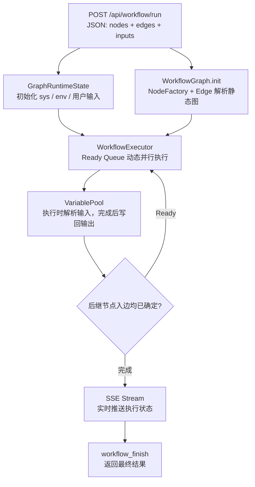

# ⚡ DiegoC Workflow

**个人学习项目** — 从零理解 Workflow 引擎的核心原理。
- DAG 校验与三态边（UNKNOWN / TAKEN / SKIPPED）
- Ready Queue 动态并行调度与条件分支
- 变量池在节点间传递数据
- 节点重试、失败分支、默认值和超时
- SQLite 状态记录与真正的 SSE 流式事件

---

## 架构



## 后端怎么设计 Workflow 引擎

### 1. 数据结构

Workflow 就是一个 DAG，用 JSON 描述：

```json
{
  "nodes": [
    {"id": "start", "data": {"type": "start", "config": {}, "input_mapping": {}}},
    {"id": "llm1", "data": {"type": "llm", "config": {"model": "deepseek-v4-pro", "api_key": "sk-xxx"}, "input_mapping": {"prompt": "start.question"}}},
    {"id": "end", "data": {"type": "end", "config": {}, "input_mapping": {"answer": "llm1.text"}}}
  ],
  "edges": [
    {"source": "start", "target": "llm1"},
    {"source": "llm1", "target": "end"}
  ]
}
```

- `nodes` — 每个节点有 id、type、config（节点特定参数）、input_mapping（从上游取哪个变量）
- `edges` — 有向边，source → target 决定执行顺序

JSON 只描述静态结构。`WorkflowGraph.init()` 遍历 `nodes`，由
`NodeFactory` 根据 `data.type` 创建具体节点；遍历 `edges` 创建 `Edge`
对象并建立邻接关系。节点构造时只接收静态 `config`、`input_mapping`
和同一次执行共享的运行态引用，不接收用户输入。

每次调用 `run()` 都会新建 `GraphRuntimeState`，把系统变量写入 `sys`、
环境变量写入 `env`、用户输入写入 start 节点命名空间。节点真正执行时
才通过 `resolve_inputs()` 从 `VariablePool` 解析输入，执行结果再写回池中。
因此同一份 Graph JSON 可以用于不同请求，运行数据不会进入节点配置。

### 2. 图推进语义

边在运行时具有 `UNKNOWN`、`TAKEN`、`SKIPPED` 三种状态。目标节点只有在所有入边均已确定且至少一条为 `TAKEN` 时才进入 Ready Queue；全部为 `SKIPPED` 时会递归跳过。`if_else` 节点通过 `_selected_handle` 选择 `true` 或 `false` 出口。

拓扑排序用于静态环检测，不再直接决定实际执行路径。

### 2.1 拓扑排序 — 静态校验

从 edges 构建邻接表 + 入度表，用 Kahn 算法 (BFS) 生成执行顺序：

```python
def topological_sort(nodes, edges):
    in_degree = {n.id: 0 for n in nodes}
    adj = {n.id: [] for n in nodes}
    for e in edges:
        adj[e.source].append(e.target)
        in_degree[e.target] += 1

    queue = deque([nid for nid, d in in_degree.items() if d == 0])
    order = []
    while queue:
        nid = queue.popleft()
        order.append(nid)
        for neighbor in adj[nid]:
            in_degree[neighbor] -= 1
            if in_degree[neighbor] == 0:
                queue.append(neighbor)
    return order
```

如果 `len(order) != len(nodes)` 则存在循环依赖。

### 3. Ready Queue — 找出哪些可以并行

节点完成后立即更新出边并检查受影响的后继节点，不需要等待同一静态层中的慢节点：

```python
if any(edge.state == UNKNOWN for edge in incoming_edges):
    wait()
elif any(edge.state == TAKEN for edge in incoming_edges):
    ready_queue.put(node_id)
else:
    skip_and_propagate(node_id)
```

Ready Queue 中的节点在并发上限内立即执行；不存在静态层间屏障。

### 4. 变量池 — 节点间传数据

每个节点执行完后把输出写入全局 pool，下游通过 input_mapping 按需读取：

```python
class VariablePool:
    _data = {}  # {"node_id": {"field": value}}

    def set(node_id, outputs):   # 写入
    def get(node_id, field):     # 读取单个值
    def resolve(input_mapping):  # 批量解析 → 组装成当前节点的输入
```

数据流：`上游输出 → pool.set() → pool.get() → 下游输入`，解耦节点间依赖。

### 5. 节点注册 + 工厂模式

每种节点类型（LLM、Code、HTTP 等）实现 `Node` 基类，通过 `NodeRegistry` 注册：

```python
class Node(ABC):
    node_type: str                        # "llm", "http", "code", ...
    @abstractmethod
    async def run(inputs) -> dict: ...    # 异步执行，返回输出

class NodeRegistry:
    _registry = {}                        # {"llm": LLMNode, "http": HTTPNode, ...}
    @classmethod
    def create(node_type, node_id, config) -> Node: ...
```

新增节点类型只需继承 `Node` + 调用 `NodeRegistry.register()`。

### 6. 执行引擎 — asyncio 动态并行

```python
class WorkflowExecutor:
    async def run(graph_config, user_inputs):
        ready = graph.roots()
        while ready or running:
            # 最多 max_concurrency 个节点并行
            # 任一节点完成后立即推进其后继边
            await wait_for_first_completed()
```

节点配置支持 `retry_config`、`timeout`、`error_strategy=fail_branch|default_value`。HTTP 副作用请求会携带同一逻辑执行内稳定的 `Idempotency-Key`。

## 节点类型

| 节点 | 功能 | 典型配置 |
|------|------|----------|
| **start** | 入口，透传用户输入 | `variables: [{name, type}]` |
| **llm** | 调 OpenAI 兼容 API | `model, api_key, base_url, system_prompt, user_prompt` |
| **code** | 执行 Python 片段 | `code` |
| **http** | 发 HTTP 请求 | `method, url, headers, body` |
| **if_else** | 条件分支 | `variable, operator, value` |
| **end** | 出口，组装输出 | `output_fields` |

## 安全说明

- Code 节点默认禁用。只有本地可信代码可设置 `ALLOW_UNSAFE_CODE_EXECUTION=true`；生产环境应接入独立容器沙箱。
- HTTP 节点默认拒绝本机、内网和非全局地址，开发环境确有需要时可设置 `WORKFLOW_ALLOW_PRIVATE_HTTP=true`。
- `test_workflow.json` 被 Git 忽略；API Key 不应保存在工作流文件中。已经暴露的 Key 必须在服务商后台吊销。
- 执行记录默认保存在 `backend/workflow_runs.db`，也可通过 `WORKFLOW_DB_PATH` 指定位置。状态查询接口为 `GET /api/workflow/runs/{run_id}`。

## 项目结构

```
DiegoC-workflow/
├── README.md
├── test_workflow.json        # 示例: 搜 LeetCode + LLM 写代码
└── backend/
    ├── main.py               # FastAPI 入口
    ├── requirements.txt
    ├── engine/
    │   ├── variable_pool.py  # 变量池
    │   ├── graph.py          # DAG 校验 + 三态边
    │   ├── node_registry.py  # 节点注册表
    │   ├── execution_store.py# SQLite 执行记录
    │   └── executor.py       # Ready Queue + 重试 + SSE
    └── nodes/
        ├── base.py           # Node 抽象基类
        ├── start_node.py
        ├── llm_node.py
        ├── code_node.py
        ├── http_node.py
        ├── if_else_node.py
        └── end_node.py
```

## License

MIT
